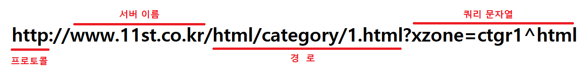
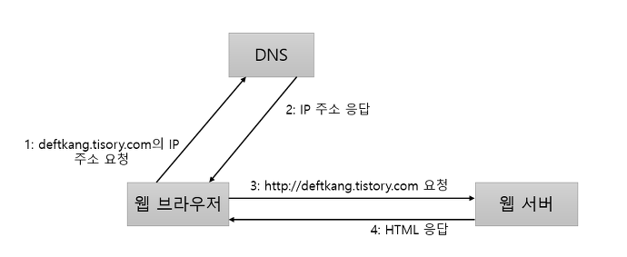

# JSP Introduction
{: .no_toc .text-beta .fw-700}

## Table of contents
{: .no_toc .text-delta }

1. TOC
{:toc}

---

## Internet & Web

### What is Internet & Web?

인터넷(internet)과 웹(web)은 대개 동의어로 쓰이지만 서로 다른 개념임

&#9656; 인터넷의 활용에서 웹의 비중이 절대적 위치를 차지하여 흔히 인터넷과 웹을 같은 의미로 사용

&#9656; 인터넷 내부에 이메일, 웹, 파일송수신, 텔넷 등이 포함

* 인터넷 : 컴퓨터가 서로 연결되어 TCP/IP라는 통신 프로토콜을 이용하여 정보를 주고 받는 전세계의 컴퓨터 네트워크

* 웹 : 인터넷을 통해 광범위한 정보를 제공할 수 있는 서비스 중 하나

    &#9656; 인터넷에 연결된 컴퓨터들을 통해 사람들이 정보를 공유할 수 있는 정보 공간

    &#9656; 월드 와이드 웹(world wide web)의 줄임말

### URL(Uniform Resource Locator)

**URL의 주요 구성 요소**

| 구성요소 | 설명 |
|:---------|:-----|
| 프로토콜 | 웹 브라우저가 서버와 내용을 주고받을 때 사용할 규칙 이름. 웹 페이지의 주소를 표현할 때는 http를 사용 |
| 서버이름 | 웹 페이지를 요청할 서버의 이름을 지정함. 서버이름은 도메인이름이나 IP주소를 입력할 수 있음 |
| 경로 | 웹 페이지의 상세 주소에 해당 |
| 쿼리 문자열 | 추가로 서버에 보내는 데이터에 해당. 같은 경로라 하더라도 입력한 값에 따라 다른 결과를 보여줘야 할 때 사용 (ex. 검색서비스) |

://
{: .label .mt-2}

프로토콜 이름과 서버 이름 사이에 위치한 "://"은 프로토콜과 나머지 부분을 구분하기 위해 사용됨

URL을 좀 더 범용적으로 정의한 URL을 확인하려면 [http://ko.wikipedia.org/wiki/URL](http://ko.wikipedia.org/wiki/URL)이나 [http://goo.gl/1gNfgx](http://goo.gl/1gNfgx) 참고

### How the Web Works

웹은 기본적으로 클라이언트/서버 방식으로 동작

클라이언트(웹 브라우저)가 특정 페이지를 웹 서버에 요청(request)하면 이를 처리한 후 그 결과를 클라이언트에게 보내어 응답(response)

즉 웹브라우저에 원하는 웹 서버 주소를 입력(요청)하면 웹 서버가 웹 브라우저를 통해 해당 웹 페이지를 제공(응답)

&#9656; 요청하는 쪽이 클라이언트(사용자)이고 응답하는 쪽이 서버(제공자)

&#9656; 가장 널리쓰이는 웹 서버로 아파치(Apache), 톰캣(Tomcat), IIS(Internet Information Server)등

### Web Browser and Web Server

**웹브라우저와 웹 서버의 통신과정**

웹 브라우저와 웹 서버는 IP주소를 이용해서 연결하기 때문에 도메인이름을 IP주소로 변환할 필요가 있음

이때 사용하는 것이 DNS(Domain Name Server)

1. 웹브라우저에서 URL을 입력

2. 도메인에 해당하는 IP주소를 DNS에 요청

3. DNS는 IP주소를 응답으로 제공

4. 웹브라우저는 받은 IP주소를 웹서버에 연결후 웹페이지 요청

5. 웹 서버로부터 응답받음

### Port

**각 서버프로그램을 클라이언트가 연결할 때 다른 서버프로그램과 구분할 때 사용하는 것**

한개의 컴퓨터는 여러개의 서버 프로그램이 실행될 수 있는데 ip주소만으로는 어떤 서버프로그램을 사용할지 모름

그래서 클라이언트가 연결할 때 각 서버프로그램을 구분할 수 있게 포트를 사용함

**ip + port = 원하는 서버프로그램 연결**

### HTML and HTTP

* HTML : 웹페이지를 만들 때 사용하는 것

* 렌더링 : HTML문서를 받은 웹 브라우저가 정해진 규칙에 따라 HTML문서를 분석해서 알맞은 화면을 생성하는 과정

* HTTP : 웹 브라우저와 웹 서버가 HTML을 비롯해 이미지, 동영상, XML문서 등 다양한 데이터를 주고 받을 때 사용하는 일종의 규칙, 쉽게말해 정보를 담는 박스라고 생각하면 됨

#### HTTP Rules

* 요청 규칙 : 웹 브라우저가 웹 서버에 HTML과 같은것을 요청할 때 사용할 데이터 구성 규칙

    &#9656; 요청데이터는 웹 브라우저가 웹 서버로부터 무엇을 받고 싶은지 기술
    
    &#8594; 요청데이터 : 요청줄, 헤더, 몸체로 구성

* 응답 규칙 : 웹 서버가 웹 브라우저에 HTML과 같은것을 전송할 대 사용할 데이터 구성 규칙

    &#9656; 요청데이터에 기술한 정보를 이용해서 웹 브라우저가 요청한 것을 응답데이터에 담아 보냄

    &#8594; 응답데이터 : 응답줄, 헤더, 몸체로 구성

요청/응답 데이터의 구성요소
{: .label .mt-2}

| 구성요소 | 요청 데이터 | 응답 데이터 |
|:---------|:------------|:------------|
| 요청/응답 줄 | GET이나 POST와 같은 HTTP 요청방식과 요청하는 자원의 경로를 지정 | 요청에 대해 200이나 404와 같은 응답코드를 전송 |
| 헤더 | 서버가 응답을 생성하는데 참조할 수 있는 정보를 전송 (브라우저의 종류나 언어 정보) | 응답에 대한 정보를 전송. 응답의 몸체가 어떤 데이터인지, 길이는 어떻게 되는지 등에 대한 정보를 담음 |
| 몸체 | 정보를 정송해야 할 때 사용 (파일 업로드와 같은 기능) | 웹 브라우저가 요청한 자원의 내용을 담음 (HTML문서나 이미지 파일 데이터 등) |

&#9656; 자원 : 위 표에서 자원이란 HTML뿐만 아니라 이미지, 자바 스크립트 코드 등 다양한 데이터를 말함

---

## Web Pages

### Technology used to Create Websites

웹을 기반으로 하는 서비스를 만들기 위해 필요한 지식은 많다

다음은 자바를 이용해서 웹사이티를 만들 때 사용하는 기술들을 나열한 것

* 개발언어 : 자바

* 웹/어플리케이션 서버 : HTTPD(아파치 웹 서버)나 NGINX, 톰켓, 웹로직 등

* 서버 웹 기술 : JSP와 서블릿

* 서버 웹 기술을 위한 프레임워크 : 스프링 MVC

* 클라이언트 웹 기술 : HTML, 자바스크립트

* 클라이언트 웹 기술을 위한 프레임워크나 라이브러리 : jQuery, 앵귤러JS

* 데이터베이스 연동 : JDBC, MyBatis, JPA

* DBMS : MySQL, MS SQL, 오라클

* 통신 프로토콜 : HTTP

* OS : 센트OS, 윈도우 서버 2012 등

### Static Web Page

**컴퓨터에 저장된 텍스트 파일을 그대로 보는 것, HTML(Hyper Text Markup Language)과 같은 웹 언어로 작성**

&#8594; 가장 단순한 형태의 웹 언어

&#9656; 추가적인 처리 과정 없이 클라이언트에게 응답을 보냄

&#9656; 회사나 개인의 소개 페이지가 정적 웹 페이지의 좋은 예시

#### How Static Web Pages Work

1. 클라이언트가 웹 브라우저를 통해 웹 서버에 웹 페이지(URL) 요청

2. 해당 URL의 웹 서버가 수신된 .html 파일을 검색

3. 이미 준비된 HTML 문서를 클라이언트에게 그대로 전송

4. 웹 브라우저가 HTML 문서를 보여줌

장점
{: .label .mt-2}

- 동적인 요소가 없기 때문에 데이터베이스가 필요없음

- 구축하기 쉬우며, 단순 문서로만 이루어져 있어 서버 간 통신이 거의 없고 속도가 빠름

- 정적 문서로만 이루어져 있기 때문에 모든 호스팅 서버에서 동작할 수 있음

단점
{: .label .label-red .mt-2}

- 미리 만들어 놓은 정보만 보여주기 때문에 고객의 취향이나 변화에 적응할 수 없음

- 새로운 것을 추가, 수정, 삭제하는 작업을 모두 수동으로 해야 하므로 관리가 어려움

### Dynamic Web Pages

**저장된 내용을 다른 변수로 가공 처리하여 보는 것**

&#9656; 기술이 발전함에 따라 사용자의 기호에 맞게 능동적으로 변화하는 웹 페이지가 필요해져서 이를 위해 동적 웹 페이지를 제공하는 PHP(Personal Home Page), ASP(Active Server Page), JSP와 같은 웹 언어가 개발됨

&#9656; 동적 페이지는 방문자와 상호작용하기 때문에 웹 페이지 상에서 특정 부분을 동적으로 바꾸는 형태로 사용해 페이지 내용은 그때그때 다름

&#9656; 댓글, 날씨, 주가 정보 등과 같이 정보 변경이 잦은 곳에 많이 사용됨 

#### How Dynamic Web Pages Work

사용자가 웹 페이지에 글을 작성하거나 환경 설정 등을 바꾸면 그내용이 서버에 있는 데이터베이스에 저장되고 결과가 웹 페이지에 반영되는 형태로 동작

1. 클라이언트가 웹 브라우저를 통해 웹 서버에 웹 페이지(URL) 요청

2. 해당 URL의 웹 서버가 요청을 분석하여 처리

3. 결과를 HTML 문서로 생성

4. 요청에 맞게 정제된 HTML 문서를 클라이언트에게 전달

5. 웹 브라우저가 HTML 문서를 보여줌

로그인하면 개인에 대한 정보와 개인만의 화면으로 구성되는 웹 사이트가 동적 웹 페이지의 대표적인 예

파이썬으로 동적 웹페이지 크롤링
{: .label .mt-2}

requests 라이브러리를 이용해서는 나타나지 않는 데이터들을 수집하는 가장 손쉬운 방법은 코드로 브라우저를 제어하는 것

Selenium 라이브러리를 사용하면 브라우저의 동작을 파이썬 코드로 조작할 수 있음

이 라이브러리를 활용해서 원하는 페이지에 접근해서 동적 데이터가 모두 로딩된 이후의 상태를 크롤링하면 됨

---

## Representative Site

### Information

* [ruinak](https://velog.io/@ruinak_4127/%EC%9B%B9%EA%B3%BC-JSP-%ED%94%84%EB%A1%9C%EA%B7%B8%EB%9E%98%EB%B0%8D-%EC%9D%B4%ED%95%B4%ED%95%98%EA%B8%B0)

* [Hogni](https://hogni.tistory.com/75)
